# MATLAB

## 一、基本操作与矩阵输入

### 1.1、调取help

在指令框中输入help function；

或者右上角搜索框中输入搜索；

### 1.2、常见量

ln（x）  =>   log(x)

e   => exp(1)

π  => pi

Inf => ∞

eps：2.2204e-016（很小的量）

i，j => 复数

ans => answer（计算出的结果，每次计算会刷新）

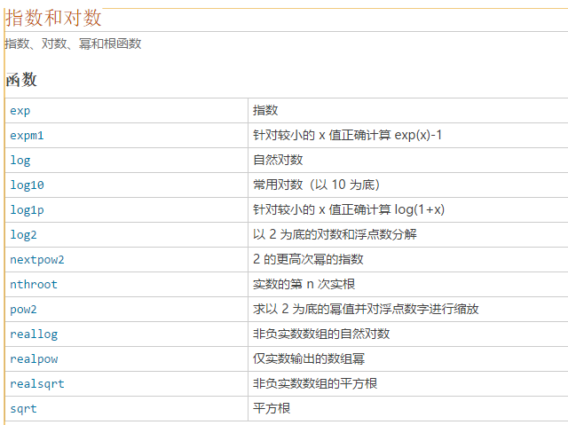

​                                                                                                  **常见的指数和对数**

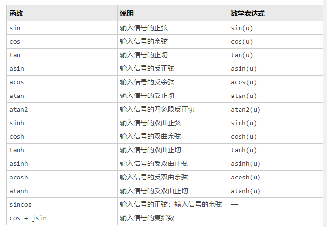

​                                                                                                  **常见的三角函数**

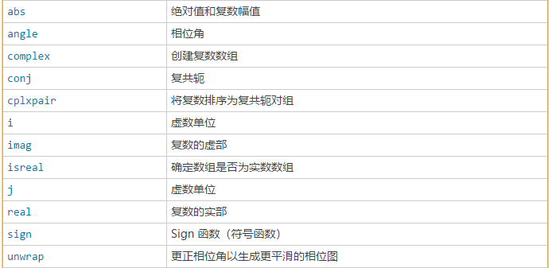

​                                                                                                          **复数**

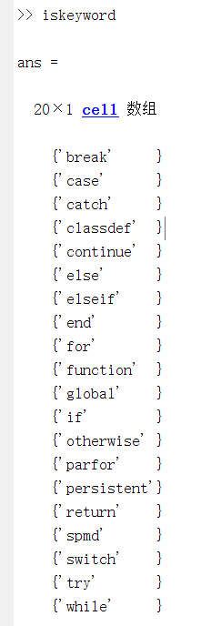

​                                                                                                      **关键词**

### 1.3、制定变量

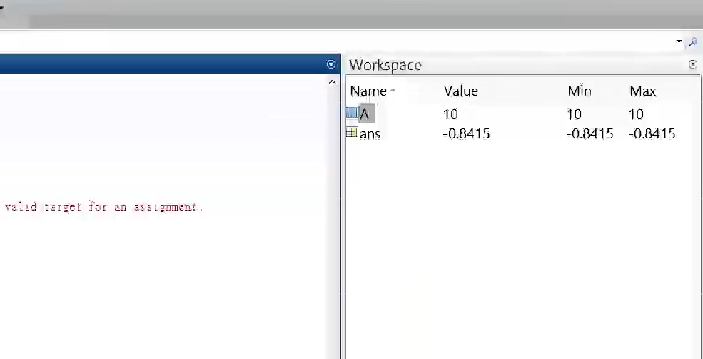

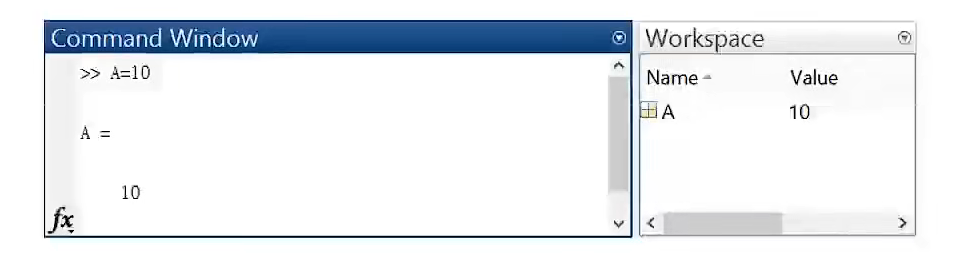

1、定义变量时，变量一定在左侧，数值在右侧。  “ = ”起到指定的作用。

2、变量的开头不能以数字开头：例” 2A = 10

​                                                             A2 = 10  “。

3、输入指令“ whos ”可以查看现有变量的详细信息（包含类型）。

4、ans（answer）算出来的结果。

5、keyword不能用来当做变量（具体keyword放在1.2中）。

6、将变量从工作区移除：输入指令clear + “ ” + 变量名 （eg：clear A）

​    （若clear后没接变量名，则将所有的变量全部清除）

### 1.4、 Format指令

format long：显示小数点后15位；

format short：显示小数点后4位；

format bank：显示小数点后2位；

format rat：显示分数；

### 1.5、向量矩阵的输入

行向量：A = [1 2 3 4]

列向量：A = [1；2；3；4]（分号表示换行）

矩阵输入：A = [1 2 3 4;5 6 7 8;9 10 11 12]

A =

     1     2     3     4
     5     6     7     8
     9    10    11    12

### 1.6、索引矩阵内的元素

**1、无逗号的形式**

A(8) = 8;**（按下图的规律）**

A =

     1  1  4  1  7  1  10
     2  1  5  1  8  1  11
     3  v  6  v  9  v  12

A( [ 1 4 9 ] )  **括号内为矩阵则索引结果为矩阵**

ans =

     1     4     9

A( [ 1 3 ;1 4 ] )**括号内有分号表索引结果生成矩阵的分行**

ans =

     1     3
     1     4

**2、有逗号的形式**

**A(row，col)-----逗号左行右列**

A(2,3)

ans =

     8

A( [ 1 3 ],[1 4] ) **------取行和列的交集生成矩阵**

ans =

     1    10
     3    12

### 1.7、colon（：） operator

输入向量/矩阵时 **用" : "引用等差**

j : k   => [ j , j + 1 , j + 2 , ... , j + m  ]

j : i : k   => [ j , j + i , j + 2 i , ... , j + m * i  ]

》》B = [1:2:8]

B =

     1     3     5     7

》》B = [1:2:9]

B =

     1     3     5     7     9

**也可以用colon operator生成矩阵**

》》B = [1:2:9;1:3:13]；

B =

     1     3     5     7     9
     1     4     7    10    13

**在索引中使用colon operator**

A( 1 , : )  **代表整行/整列**

》》A( 1 ,  : ) --------取第一行整行

ans =

     1     4     7    10

》》A( : ,1 ) --------取第一列整列

ans =

     1
     2
     3

### 1.7、矩阵计算

**生成增广矩阵**

C = [ A B ]；

**矩阵的运算**       

​    +    -  *  /  ^  .  '

​    + / - :矩阵对应位置相加减；

​    *：左行乘又列依次置于新向量中；

​    .*:  矩阵对应位置相乘；

​    ^:    矩阵幂次方；

​    .^：矩阵每个位置的元素幂次方；

​     ’  ：矩阵转置

### 1.8、特殊矩阵

**1、eye（n）------但未矩阵**

》》C = eye(3)

C =

     1     0     0
     0     1     0
     0     0     1

**2、zeros( n , m )  --------n行m列的零矩阵**

》》D = zeros ( 3 , 4 )

D =

     0     0     0     0
     0     0     0     0
     0     0     0     0

**3、ones ( n , m ) ---------n行m列的1矩阵**

**4、diag( )--------对角线矩阵(括号内为对角线矩阵中的元素)**

》》E = diag ( [ 2 3 4 ] )

E =

     2     0     0
     0     3     0
     0     0     4

### 1.8、related function

1、max ( A ) ----------矩阵A每一列的最大值；

A =

     1     3     5
     7     9    11
    13    15    17

》》max ( A )

ans =

    13    15    17

2、max(max(A))---------可以找出矩阵的最大值

》》 max ( max ( A ) )

ans =

    17                                                                                            

3、min( A )----------矩阵A每一列的最小值；

4、sum( A ) ----------矩阵A每一列的加和；

5、mean( A ) ----------矩阵A每一列的平均值；

6、sort ( B )----------矩阵A每一列从大到小排序；

B =

     3     5     7
     0     6     9
     8     9    10

》》 sort ( B )

ans =

     0     5     7
     3     6     9
     8     9    10

7、sortrows ( B )----------矩阵A**行绑定在一起**，按第一列从大到小排序；

》》sortrows ( B )

ans =

     0     6     9
     3     5     7
     8     9    10

8、size ( C )-------------计算矩阵的维度，左行右列；

C =

     1     2     3
     4     5     6

》》size ( C )

ans =

     2     3

9、find（ C ）-----------找具体元素的位置

》》 find ( C == 5 )

ans =

     4

## 二、结构化程式和自定义函数

### 2.1、结构化程式

#### 2.1.1、注释和分节

% sin ( A ) ----------------单个%表示注释

%% -------------------------双%表示分节，运行时可按节运行

#### 2.1.2、逻辑关系

1、<    -------------------- 小于；

2、<=    ------------------ 小于等于；

3、>    -------------------- 大于；

4、>=    ------------------ 大于等于；

5、==    ------------------ 等于；

6、~=    ------------------ 不等于；

7、&&    -----------------  与（and）；

8、||    ------------------ 或（or）；

#### 2.1.3、if else

if  **condition1**                       condition----条件

​        **statement1**                  statement----事件

elseif  **condition2**

​        **statement2**

else

​        **statement3**

end

--------------------------------------------------------------

**案例**

a = 3;
if rem(a , 2) == 0 ---------------------rem ( a , b ) ------ a / b取余数;
     disp ('a is even')------------------disp类似于console.log( );
else
    disp('a is odd')
end

#### 2.1.4、switch

switch **expression**

case **value1**

​           **statement1**

case **value2**

​           **statement2**

...

...

otherwise

​           **statement**

end

------------------------------------------------------------

**案例**

input_num = 5;

switch input_num

case   -1

​         disp('negative 1')

case   0

​         disp('zero')

case   1

​         disp('positive 1')

otherwise

​         disp('other value')

end

#### 2.1.5、while

##### 2.1.5.1、常规

while **condition**

​          **statement**

end

----------------------------------

**案例**

n = 1;

while prod（1:n）<1e100   -------------**prod( )---------连乘**

​            n =  n + 1;                                    **e100 = 10^100**

end

##### 2.1.5.2、break跳出循环

while condition

​     statement

​     **if condition2**

​          **break**

​      **end**

end

#### 2.1.6、for

for **variable = start : increment : end**-------------参考colon operator

​            commands

end

----------------------

案例

for  n = 1：10

​         a ( n ) = 2 ^ n ;

end

disp ( a )

  1 至 9 列

           2           4           8          16          32          64         128         256         512

  10 列

        1024

#### **2.1.7、tips**

1、clear all -----------清除所有变量；

2、close all -----------清除所有图表；

3、clc-------------------清空命令窗口；

4、; ---------------------使计算结果在命令窗口不显示；

5、...---------------------换行；

6、ctrl  + c--------------关闭终端；（程序未响应时使用）

### 2.2、自定义函数

**实例（三部分）**

1    function  y = mean ( x )

2    %注释

3    matlab code

-----------------------------------------------------------

y----------------输出

x----------------输入

mean----------函数名称（名字和 .m文件相同）

-----------------------------------

定义函数的默认变量：

1、nargin------------输入的个数，输入一个值nargin = 1；

2、nargout----------输出的个数；

3、varargin----------输入的长度；

4、varargout--------输出的长度（**length**）；

#### 2.2.1、function handles

实例

f = @ ( x ) exp( - 2 * x );

以后调用f ( x )则指向 f = **@ ( x )** exp( - 2 * x );

@ ( x ) 代表将 x 丢入 f 中；

## 三、变量与档案存取

### 3.1、变量类型转换

1、double();

2、single();

3、int8();

4、int16();

5、int32();

6、int64();

7、uint8();

8、uint16();

9、uint32();

10、uint64();

**当做function来使用；**

### 3.2、字符串的转换和合并

#### 3.2.1、转换

uint16（**char**）-----------会得到char的ASCLL码;

#### 3.2.2、合并

1、s3 = [s1 s2];----------直接合并为一个字符串；

2、s4 = [s1 ; s2];---------变为列向量，合并的前提为字符串长度一致；

### 3.3、字符串操作

**1、字符串中每个char有自己的位置**

**实例**

A = 'aardvark’

》》A(3)

ans =

    'r'

**2、A == ‘a’----------判断每个位置是否等于a**

》》A == 'a'

ans =

  1×8 logical 数组

   1   1   0   0   0   1   0   0

**3、A ( A == 'a' ) = ‘ Z ’**

将所有 a 替换为 Z （**A =='a'找出所有a的位置**）；

》》A ( A == 'a' ) = 'Z'

A =

    'ZZrdvZrk'

### 3.4、Structure

使用方法与 **JS** 的对象类似

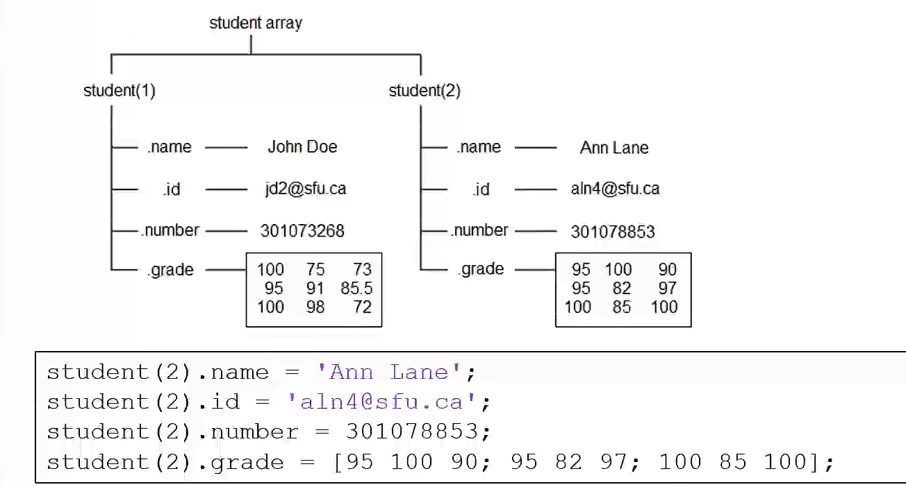

定义方式：student（）.name = "........"

structure中可以嵌套其他的structure；

#### 3.4.1、结构的指令

1、fieldnames()--------------查看结构中所有的键名

2、rmfield( n , ' m ' )----------删除键名；n：structure name

​                                                                    m：键名

### 3.5、cell

类似矩阵，但每个位置的类型可以不同（矩阵每个位置的类型都为数值）；(**可以视为矩阵？**)

#### 3.5.1、宣告方式

1、A ( 1 , 1 ) = { [ 1 4 3 ; 0 5 8 ; 7 2 9 ] }

​      A ( 1 , 2 ) = { ' anne smith ' }

​      A ( 2 , 1 ) = { 3 + 7 i }

​      A ( 2 , 2 ) = { -pi : pi : pi }

2、A{ 1 , 1 } = [ 1 4 3 ; 0 5 8 ; 7 2 9 ]

​      A{ 1 , 2 } = ' anne smith '

​      A{ 2 , 1 } = 3 + 7 i

​      A{ 2 , 2 } = -pi : pi : pi

(两种宣告方式大括号的位置不同)

》》A(1,1)={[1 4 3 ; 0 5 8 ; 7 2 9 ] }

A(1,2)={'anne smith'}

A(2,1)={3+7i}

A(2,2)={-pi:pi:pi}

A =

  2×2 cell 数组

    {3×3 double        }    {'anne smith'}
    {[3.0000 + 7.0000i]}    {1×3 double  }

3、>> B = {"james bond" **,** [1 2 ; 2 3 **;** 4 5]**;**pi **,**magic(5)}

(,表示分隔，；表示换行，与矩阵的宣告类似，空格改为 ‘ , ’ 表示)

B =

  2×2 cell 数组

    {["james bond"]}    {3×2 double}
    {[      3.1416]}    {5×5 double}

#### 3.5.2、查看cell的内容

**要用大括号**

》》 A{1,1}

ans =

     1     4     3
     0     5     8
     7     2     9

**用小括号可以查看cell具体位置的类型**

》》A(1,1)

ans =

    1×1 cell 数组
    {3×3 double}

#### 3.5.3、查看cell中矩阵具体位置的内容

**A { row , col } ( row , col )**

》》A{1,1}(1,2)

ans =

     4

#### 3.5.4、矩阵转cell

1、num2cell()-----------矩阵与cell的位置一 一对应；

实例

A =

     1     4     3
     0     5     8
     7     2     9

》》num2cell(A)

ans =

  3×3 cell 数组

    {[1]}    {[4]}    {[3]}
    {[0]}    {[5]}    {[8]}
    {[7]}    {[2]}    {[9]}

2、mat2cell()------------将矩阵分块转换为cell；

mat2cell( name,row,col )

**实例**

》》C = mat2cell(a,[1 1 1],3)

C =

  3×1 cell 数组

    {1×3 double}
    {1×3 double}
    {1×3 double}

### 3.6、reshape

用以改变矩阵的维度(**对cell array同样适用**)

(将r1行c1列的矩阵转变为r2行c2列的新矩阵，**前提**为r1 X c1 = r2 X c2)

B =

  2×2 cell 数组

    {["james bond"]}    {3×2 double}
    {[      3.1416]}    {5×5 double}

》》 reshape(B,1,4)

ans =

  1×4 cell 数组

  1 至 3 列

    {["james bond"]}    {[3.1416]}    {3×2 double}

  4 列

    {5×5 double}

### 3.7、数据文件的存储

LOAD AND SAVE

#### 3.7.1、save

保存workspace中所有数据到一个文件

clear；

a = magic(4);

save fillname.mat --------------------**保存的文件只能用matlab打开**

save fillname.mat  -ascii-------------**保存的文件可以用txt等其他方式打开**

#### 3.7.2、load

1、load('fillname.mat');

2、load('fillname.mat’,‘-ascii');-----------**用ascii方式保存的文件要标注出来**

#### 3.7.3、读取excel文件

1、变量名 = xlsread('fillname.xlsx')

2、变量名= xlsread('fillname.xlsx','B2:D4')

B2:D4--------------**指定读取的区域**

若输入两个变量名则将标头也导入到matlab

**（第一个变量赋数值，第二个变量赋标头）**

》》[data head] = xlsread('123.xlsx')

data =

     1     2     3
     4     5     6
     7     8     9

head =

  4×4 cell 数组

    {0×0 char}    {'哈哈'  }    {'呵呵'  }    {'嘻嘻'  }
    {'你好'  }    {0×0 char}    {0×0 char}    {0×0 char}
    {'您好'  }    {0×0 char}    {0×0 char}    {0×0 char}
    {'李好'  }    {0×0 char}    {0×0 char}    {0×0 char}

#### 3.7.4、将数据写入excel文件

xlswrite('fillname.xlsx',variable,sheet,'location')

实例

1、插入数据

M = mean(score')'

xlswrite('04Score.xlsx',M,1,'E2:E4')

2、插入标头

xlswrite('04Score.xlsx',{'mean'},1,'E1')

#### 3.7.5、读写fill(low-level File)

## 四、初阶绘图

### 4.1、plot

plot(x,y)------------------本质是描点连线

**实例**

plot(cos(0:pi/20:2*pi));

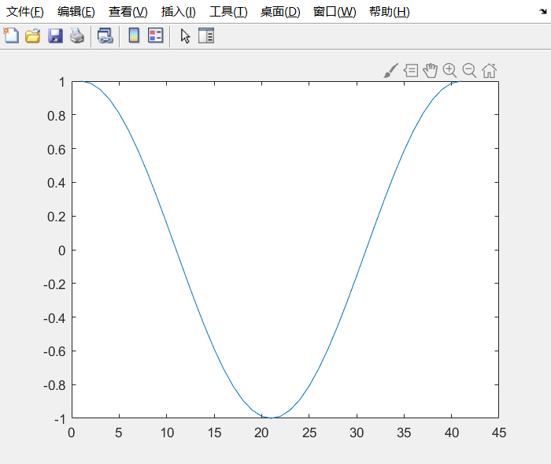

也可以一次plot绘制多个图：

》》x = 0:0.5:4*pi;

y = sin(x); 

h = cos(x);

w = 1./(1+exp(-x));

g = (1/(2 * pi * 2)^0.5).*exp((-1. *(x-2 * pi).^2 )./(2*2^2));

plot(x,y,'bd-',x,h,'gp:',x,w,'ro-',x,g,'c^-');

legend('sin(x)','cos(x)','sigmoid(x)','Gauss function(x)');

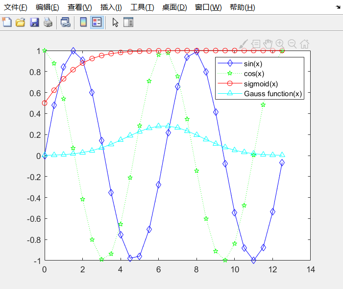

### 4.2、hold on

matlab每次画图会进行刷新

要想保留之前的绘图使用hold on指令(关闭使用hold off)；

**hold on;**

plot(cos(0:pi/20:2*pi));

plot(sin(0:pi/20:2*pi));

**hold off;**

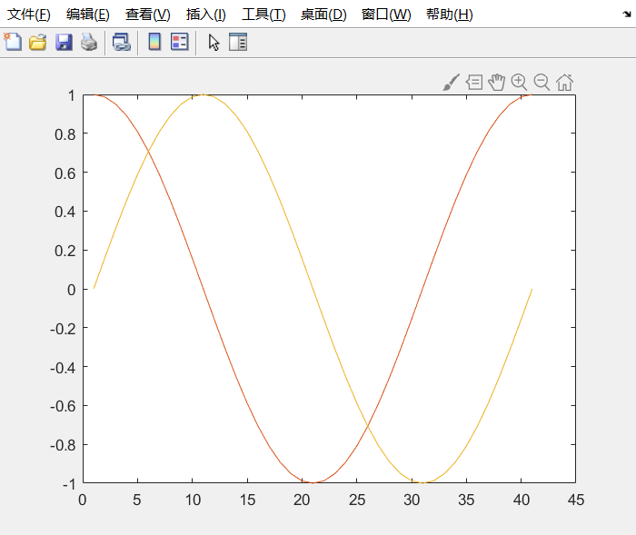

### 4.3、plot style

#### 4.3.1、Data markers:

dot(.)------------------------------  .

asterisk(*)----------------------  *

cross(x)--------------------------  x

circle(o)--------------------------  o

plus sign(+)---------------------  +

square(口)----------------------  s

diamond(菱形)----------------  d

Five-pointed star(☆)--------  p

Triangle(down)---------------  v

Triangle(up)-------------------  ^

Triangle(left)------------------  <

Triangle(right)----------------  >

-------------------------------

MarkerEdgeColor----------------------标点内部颜色；

MarkerFaceColor-----------------------标点边框颜色；

MarkerSize--------------------------------标注点大小；

**实例**

》》x=rand(20,1);

set(gca,'FontSize',18);

plot(x,'-md','LineWidth',2,'MarkerEdgeColor','k','MarkerFaceColor','g','MarkerSize',10);

xlim([1,20]);

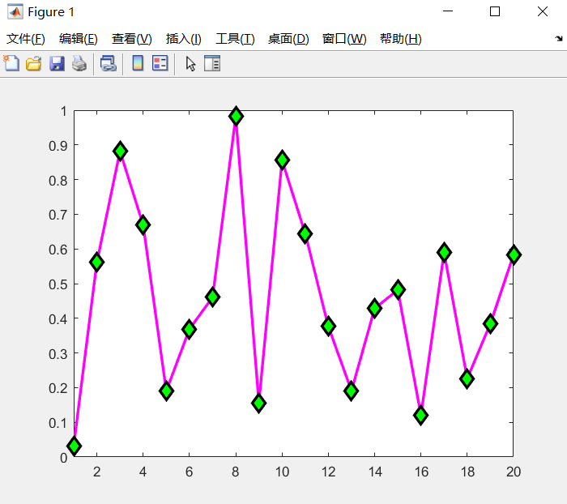

#### 4.3.2、line types:

直线------------------------------  -

虚线------------------------------  --

'  .-  '------------------------------  -.

点  --------------------------------  :

#### 4.3.3、color:

black-----------------------------  k

blue------------------------------  b

cyan------------------------------  c

green----------------------------  g

magenta------------------------  m

red--------------------------------  r

white-----------------------------  w

yellow----------------------------  y

#### 4.3.4、设定style：

plot(x,y,'str')

**实例**

（可以将不同的属性拼接，例如红色线虚线五星）

plot(cos(0:pi/20:2*pi),'p--r');

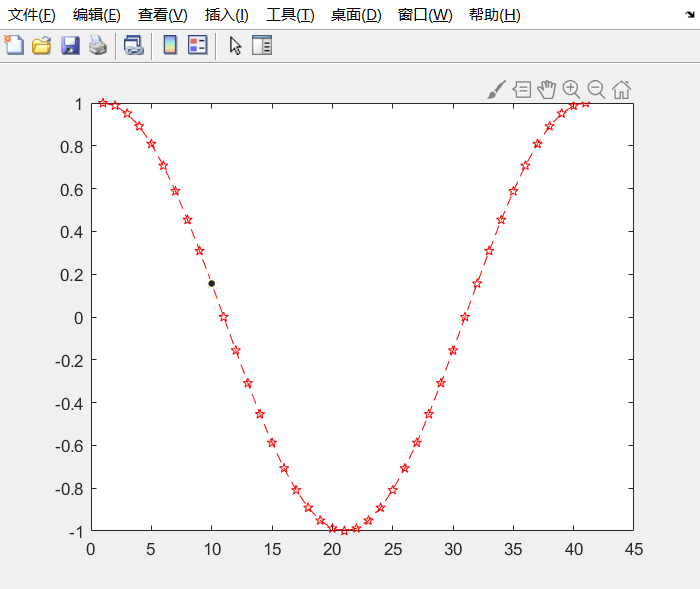

### 4.4、legend

生成标注

》》x = 0:0.5:4*pi;

y = sin(x); 

h = cos(x);

w = 1./(1+exp(-x));

g = (1/(2 * pi * 2)^0.5).*exp((-1. *(x-2 * pi).^2 )./(2*2^2));

plot(x,y,'bd-',x,h,'gp:',x,w,'ro-',x,g,'c^-');

legend('sin(x)','cos(x)','sigmoid(x)','Gauss function(x)');

**(标注的顺序与plot中绘制的顺序一一对应)**

### 4.5、title () and label ()

1、title();

2、xlabel();

3、ylabel();

4、zlabel();

**实例**

》》x=0:0.1:2*pi;

y1=sin(x);

y2=exp(-x)

plot(x,y1,'--*',x,y2,':o');

xlabel('t = 0 to 2\pi');

ylabel('values of sin(t) and e^{-x}');

title('function plots of sin(t) and e^{-x}');

**(\pi 是字符串的π ; e^{-x)是字符串的e的-x次方)**

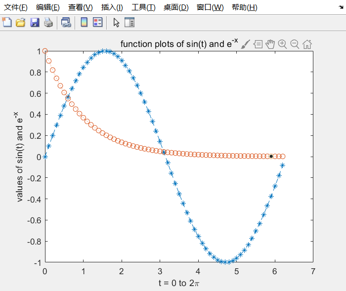

### 4.6、text()and annotation()

text(起点x,起点y,文字的变量名**,'Interpreter','latex'**);------------------文字描述

annotation('arrow','X',[x起点,x终点],'Y',[y起点,y终点]);------------------箭头指针

**（数学的标注要用到latex，例如积分号等等，interpreter，latex为常规用法）**

》》x=linspace(0,3);

y=x.^2.*sin(x);

plot(x,y);

line([2,2],[0,2^2*sin(2)]);

str='$$ \int_{0}^{2} x^2\sin(x) dx $$)'

text(0.25,2.5,str,'Interpreter','latex');

annotation('arrow','X',[0.32,0.5],'Y',[0.6,0.4]);

**(str='$$ \int_{0}^{2} x^2\sin(x) dx $$)'  为数学表达式的字符串形式)**

**( line ( [ 起点x , 终点x ] , [ 起点y , 终点y ] ) --------画线段)**

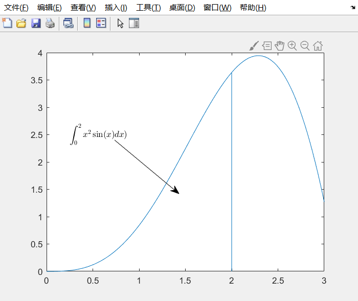

### 4.7、figure properties

在图表生成后，点击编辑；

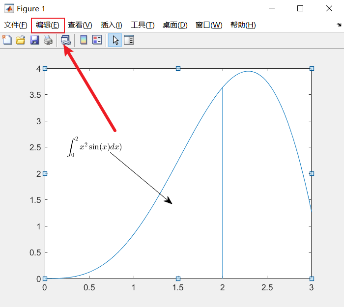

选择图窗属性；

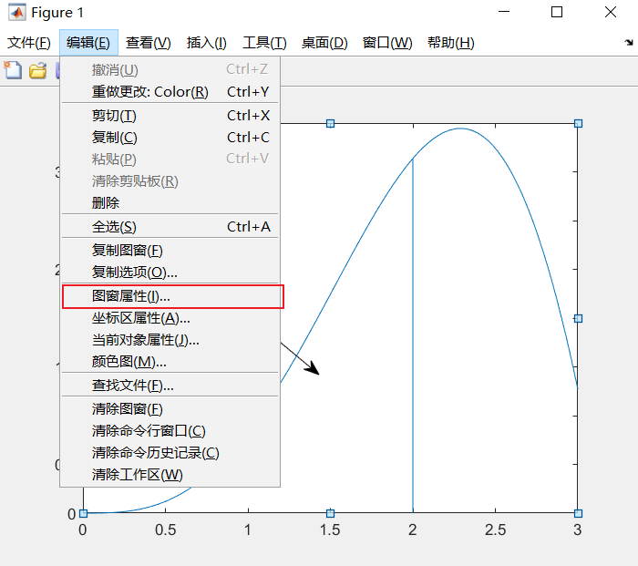

点击不同的元素进行属性的调整

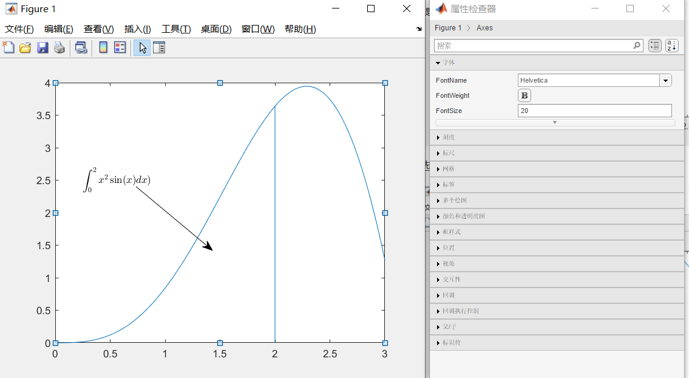

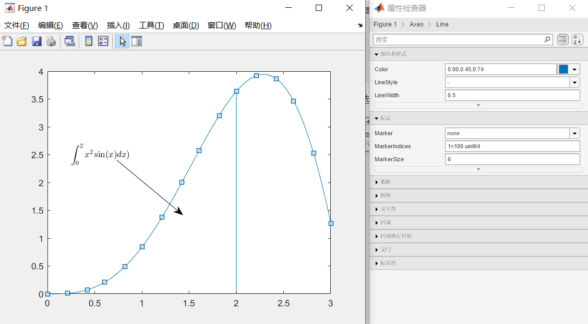

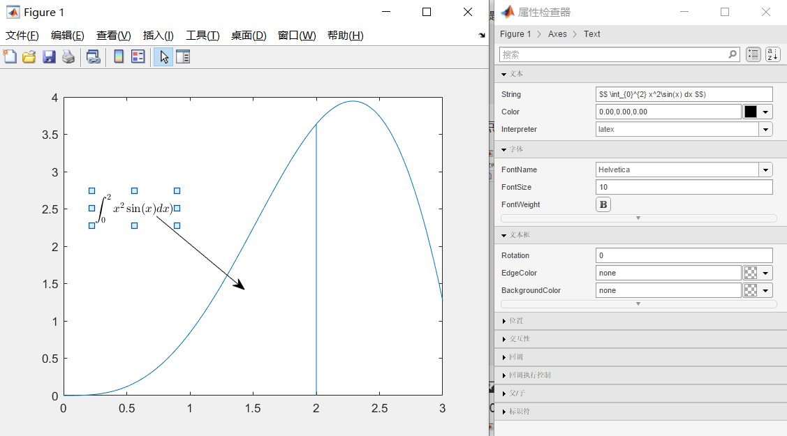

#### 4.7.1、图表的辨识码

在plot生成图表时会生成，可以赋值给变量；

eg：  h = plot ( x , y );

Figure的辨识码：qcf

Axes的辨识码：gca

#### 4.7.2、获得和修改图表属性

**获得属性：**

get();----------------------get中传**辨识码**

**修改属性：**

set(辨识码，‘属性名’，属性内容);

**实例**

》》get(gca);

                       ALim: [0 1]
                   ALimMode: 'auto'
     ActivePositionProperty: 'outerposition'
                 AlphaScale: 'linear'
                   Alphamap: [1×64 double]
          AmbientLightColor: [1 1 1]
               BeingDeleted: 'off'
                        Box: 'off'
                   BoxStyle: 'back'
                 BusyAction: 'queue'
              ButtonDownFcn: ''
                       CLim: [0 1]
                   CLimMode: 'auto'
             CameraPosition: [0.5000 0.5000 9.1603]
         CameraPositionMode: 'auto'
               CameraTarget: [0.5000 0.5000 0.5000]
           CameraTargetMode: 'auto'
             CameraUpVector: [0 1 0]
         CameraUpVectorMode: 'auto'
            CameraViewAngle: 6.6086
        CameraViewAngleMode: 'auto'
                   Children: [0×0 GraphicsPlaceholder]
                   Clipping: 'on'
              ClippingStyle: '3dbox'
                      Color: [1 1 1]
                 ColorOrder: [7×3 double]
            ColorOrderIndex: 1
                 ColorScale: 'linear'
                   Colormap: [64×3 double]
                  CreateFcn: ''
               CurrentPoint: [2×3 double]
            DataAspectRatio: [1 1 1]
        DataAspectRatioMode: 'auto'
                  DeleteFcn: ''
                  FontAngle: 'normal'
                   FontName: 'Helvetica'
                   FontSize: 10
               FontSizeMode: 'auto'
              FontSmoothing: 'on'
                  FontUnits: 'points'
                 FontWeight: 'normal'
                  GridAlpha: 0.1500
              GridAlphaMode: 'auto'
                  GridColor: [0.1500 0.1500 0.1500]
              GridColorMode: 'auto'
              GridLineStyle: '-'
           HandleVisibility: 'on'
                    HitTest: 'on'
              Interruptible: 'on'
    LabelFontSizeMultiplier: 1.1000
                      Layer: 'bottom'
                     Legend: [0×0 GraphicsPlaceholder]
             LineStyleOrder: '-'
        LineStyleOrderIndex: 1
                  LineWidth: 0.5000
             MinorGridAlpha: 0.2500
         MinorGridAlphaMode: 'auto'
             MinorGridColor: [0.1000 0.1000 0.1000]
         MinorGridColorMode: 'auto'
         MinorGridLineStyle: ':'
                   NextPlot: 'replace'
              OuterPosition: [0 0 1 1]
                     Parent: [1×1 Figure]
              PickableParts: 'visible'
         PlotBoxAspectRatio: [1 0.7882 0.7882]
     PlotBoxAspectRatioMode: 'auto'
                   Position: [1×4 double]
                 Projection: 'orthographic'
                   Selected: 'off'
         SelectionHighlight: 'on'
                 SortMethod: 'childorder'
                        Tag: ''
                    TickDir: 'in'
                TickDirMode: 'auto'
       TickLabelInterpreter: 'tex'
                 TickLength: [0.0100 0.0250]
                 TightInset: [1×4 double]
                      Title: [1×1 Text]
    TitleFontSizeMultiplier: 1.1000
            TitleFontWeight: 'normal'
                    Toolbar: [1×1 AxesToolbar]
                       Type: 'axes'
              UIContextMenu: [0×0 GraphicsPlaceholder]
                      Units: 'normalized'
                   UserData: []
                       View: [0 90]
                    Visible: 'on'
                      XAxis: [1×1 NumericRuler]
              XAxisLocation: 'bottom'
                     XColor: [0.1500 0.1500 0.1500]
                 XColorMode: 'auto'
                       XDir: 'normal'
                      XGrid: 'off'
                     XLabel: [1×1 Text]
                       XLim: [0 1]
                   XLimMode: 'auto'
                 XMinorGrid: 'off'
                 XMinorTick: 'off'
                     XScale: 'linear'
                      XTick: [1×11 double]
                 XTickLabel: {11×1 cell}
             XTickLabelMode: 'auto'
         XTickLabelRotation: 0
                  XTickMode: 'auto'
                      YAxis: [1×1 NumericRuler]
              YAxisLocation: 'left'
                     YColor: [0.1500 0.1500 0.1500]
                 YColorMode: 'auto'
                       YDir: 'normal'
                      YGrid: 'off'
                     YLabel: [1×1 Text]
                       YLim: [0 1]
                   YLimMode: 'auto'
                 YMinorGrid: 'off'
                 YMinorTick: 'off'
                     YScale: 'linear'
                      YTick: [1×11 double]
                 YTickLabel: {11×1 cell}
             YTickLabelMode: 'auto'
         YTickLabelRotation: 0
                  YTickMode: 'auto'
                      ZAxis: [1×1 NumericRuler]
                     ZColor: [0.1500 0.1500 0.1500]
                 ZColorMode: 'auto'
                       ZDir: 'normal'
                      ZGrid: 'off'
                     ZLabel: [1×1 Text]
                       ZLim: [0 1]
                   ZLimMode: 'auto'
                 ZMinorGrid: 'off'
                 ZMinorTick: 'off'
                     ZScale: 'linear'
                      ZTick: [0 0.5000 1]
                 ZTickLabel: ''
             ZTickLabelMode: 'auto'
         ZTickLabelRotation: 0
                  ZTickMode: 'auto'

set(gca,'XLim',[0,2*pi]);-------------**将x轴变为0-2π；**

set(gca,‘FontSize’,25);---------------**将字体尺寸变为25；**

linspace(x1,x2,N)------------**用于产生x1,x2之间的N点行线性的矢量；**

》》x=linspace(0,2*pi,1000)

y=sin(x)

h = plot(x,y)

set(gca,'XTick',0:pi/2:2*pi)

set(gca,'XTickLabel',0:90:360)

set(gca,'XLim',[0,2*pi])

set(gca,'YLim',[-1.2,1.2])

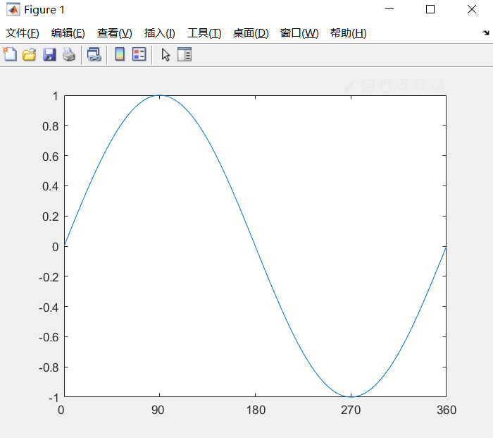

将label用符号的形式展示：

set(gca,'FontName','symbol');-------------------**坐标名用symbol形式；**

set(gca,'XTickLabel',{'0','p/2','p','3p/2','2p'})

-------------------------------------------

set可以一次修改多个属性：

实例：

set(h,'LineStyle','-.','LineWidth',7.0,'Color','g');

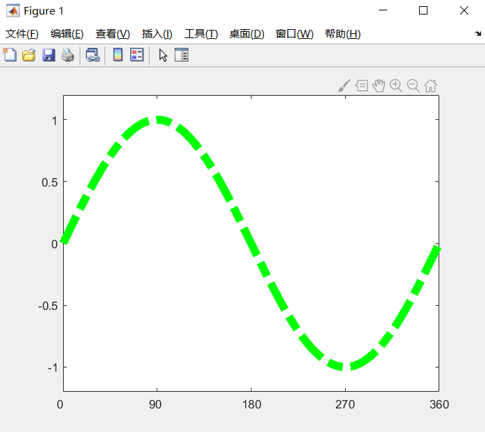

### 4.8、绘制多个图

呼叫figure指令;

**实例**

》》x=-10:0.1:10;

y1=x.^2-8;

y2=exp(x);

figure,plot(x,y1);

figure,plot(x,y2);

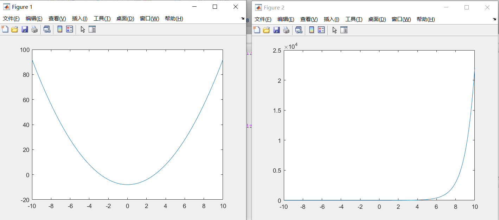

**（生成两个图表后，gac和gcf只能锁定到新绘制的图表，丢失对figure1的handle）**

### 4.9、图的位置和大小

figure( 'Position' , [ left,bottom,width,height ] )

--------------------------------------------

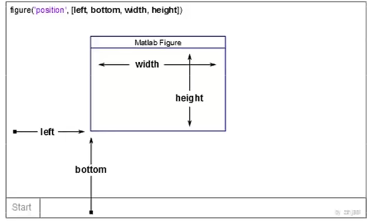

### 4.9、several plot in one figure

subplot(m,n,i);

m------------------row的数量；

n--------------------col的数量；

i---------------------图的具体位置；

---------------------------------------------------------------------------

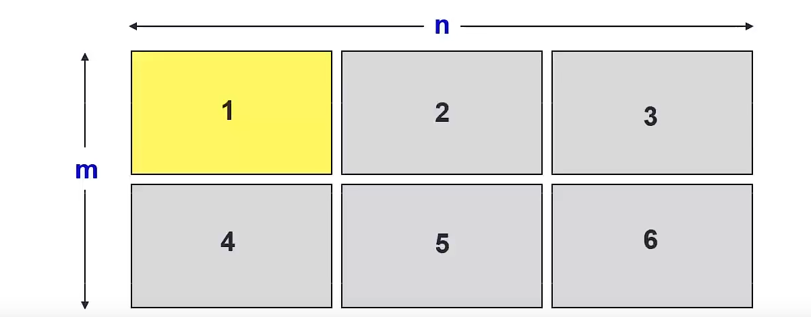

----------------------------

**实例**

》》t = 0:0.1:2*pi;

x = 3*cos(t);

y = sin(t);

subplot(2,2,1);plot(x,y);axis normal;

subplot(2,2,2);plot(x,y);axis square;

subplot(2,2,3);plot(x,y);axis equal;

subplot(2,2,4);plot(x,y);axis tight;

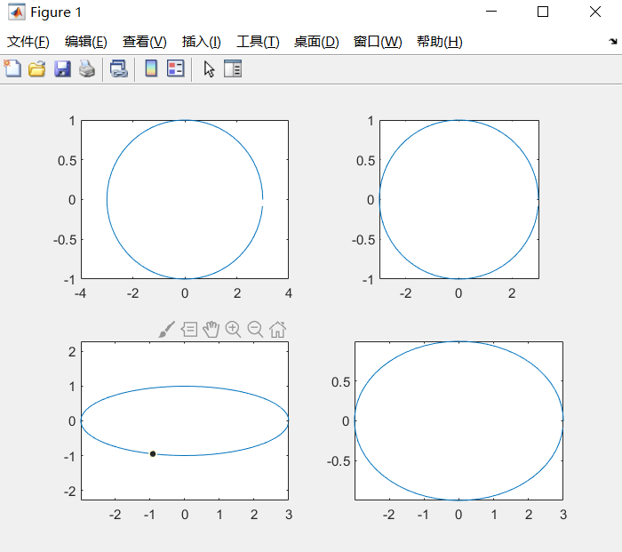

**(axis square-----------------坐标轴横坐标纵坐标长度相同；**

**axis equal---------------------坐标轴横坐标纵坐标间隔相同；**

**axis tight-----------------------axis与图表相切；)**

### 4.10、栅格、坐标轴、上(右)边界线的开关

grid  on(off);

axis on(off);

box on(off);

---------------------------------------------

**实例**

》》grid on;

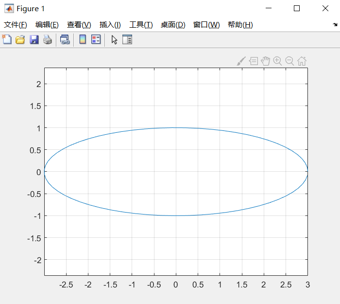

》》box off;

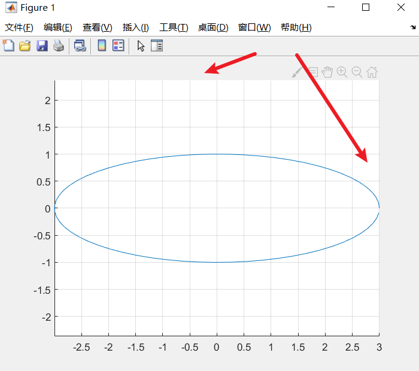

》》axis off；

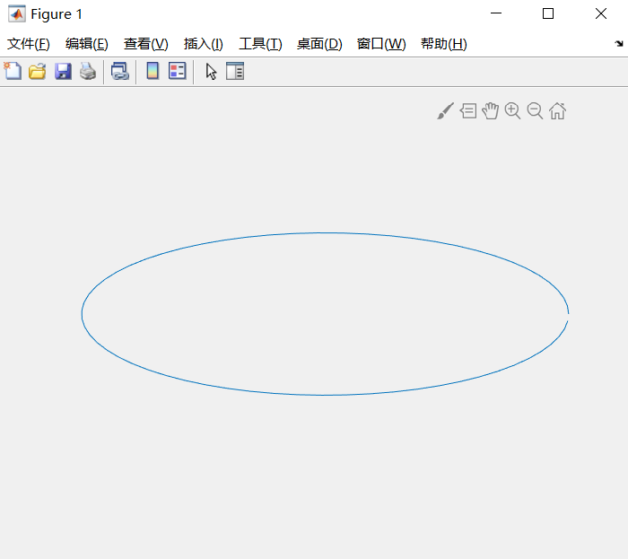

### 4.11、图表的保存

saveas(gcf,'<filename>','<formattype>')

------------------------------------------------------------------

formattype:

1、bitmap(文件小，清晰度不足)

’JPEG‘

'png'

'tiff'

'bmp'

2、vector(清晰)

'pdf'

'eps'

--------------------------------------------

**实例**

saveas(gcf,'picture1','pdf')

--------------------------------------------------------------------

print-------------------高解析度存储；
